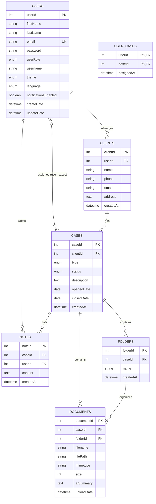

# ⚖️ LegalTrack — Backend

REST API + WebSocket server + AI integration for the LegalTrack case management system.

---

## 🚀 Tech Stack

| Component | Technology |
|-----------|-----------|
| Runtime | Node.js |
| Framework | Express |
| Database | MySQL 8+ |
| ORM | Sequelize |
| Real-time | Socket.IO |
| File Upload | Multer |
| AI Provider | Groq API (`llama-3.3-70b-versatile`) |
| PDF Parsing | pdf2json |

---

## 📁 Project Structure

```
Legaltrack-Backend/
├── src/
│   ├── server.js                  ← Express app entry point, Socket.IO setup
│   ├── routes/
│   │   ├── auth.js                ← /api/auth
│   │   ├── users.js               ← /api/users
│   │   ├── clients.js             ← /api/clients
│   │   ├── cases.js               ← /api/cases
│   │   ├── documents.js           ← /api/documents
│   │   ├── folders.js             ← /api/folders
│   │   ├── notes.js               ← /api/notes
│   │   ├── settings.js            ← /api/settings
│   │   └── ai.js                  ← /api/ai
│   ├── controllers/
│   │   ├── authController.js
│   │   ├── usersController.js
│   │   ├── clientsController.js
│   │   ├── casesController.js
│   │   ├── documentsController.js
│   │   ├── foldersController.js
│   │   ├── notesController.js
│   │   ├── settingsController.js
│   │   └── aiController.js
│   └── middleware/
│       ├── auth.js                ← Role-based access control (403 Forbidden)
│       ├── identify.js            ← Extracts userId from x-user-id header
│       ├── logger.js              ← Logs method, URL, status, duration
│       └── upload.js              ← Multer config (file type validation)
├── models/
│   ├── index.js                   ← Sequelize connection + all associations
│   ├── User.js
│   ├── Client.js
│   ├── Case.js
│   ├── Document.js
│   ├── Folder.js
│   ├── Note.js
│   └── UserCase.js                ← Junction table (many-to-many)
├── migrations/
│   ├── schema.sql                 ← Full SQL schema (reference)
│   └── seed.js                    ← Demo data seeder
├── uploads/                       ← Uploaded files storage (gitignored)
├── .env.example
├── .gitignore
└── package.json
```

---

## ⚙️ Installation

### Prerequisites
- Node.js v18+
- MySQL 8+
- A free [Groq API key](https://console.groq.com)

### 1. Install dependencies
```bash
cd Legaltrack-Backend
npm install
```

### 2. Create the database
```bash
mysql -u root -p
```
```sql
CREATE DATABASE legaltrack;
exit
```

### 3. Configure environment variables
Create a `.env` file (see `.env.example`):
```
PORT=3000

DB_HOST=localhost
DB_PORT=3306
DB_NAME=legaltrack
DB_USER=root
DB_PASSWORD=your_mysql_password

GROQ_API_KEY=your_groq_api_key
```

### 4. Seed demo data (optional but recommended)
```bash
node migrations/seed.js
```
This creates 2 demo users, 2 clients, and 2 cases.

### 5. Start the server
```bash
node src/server.js
```
Sequelize automatically creates all tables on first run via `sequelize.sync()`.

> Server runs on **http://localhost:3000**
> API base path: **http://localhost:3000/api**

---

## 👤 Demo Credentials

| Email | Password | Role |
|-------|----------|------|
| david@legaltrack.com | 123456 | admin |
| sarah@legaltrack.com | 123456 | manager |

---

## 🔑 Authentication Model

This project uses a simplified header-based auth (no JWT signature verification), suitable for course requirements:

| Header | Description |
|--------|-------------|
| `x-user-id` | The authenticated user's ID |
| `x-user-role` | The authenticated user's role (`admin` / `manager` / `user`) |

These headers are set automatically by the frontend after login (stored in `localStorage`), and required on protected routes.

---

## 🛡️ Middleware

### `logger.js`
Runs globally on every request. Logs:
```
[2026-06-21T10:00:00.000Z] POST /api/cases - 201 (45ms)
```

### `auth.js` (Role-based access control)
```javascript
router.post('/', authorize('admin', 'manager'), createClient);
```
Returns `403 Forbidden` with the required error format if the role doesn't match.

### `identify.js`
Extracts `x-user-id` and attaches it as `req.userId`. Used by routes that need to know "who is asking" (e.g. `/auth/me`, `/settings`, `/notes`).

### `upload.js`
Multer configuration. Accepts: PDF, Word (.doc/.docx), Excel (.xls/.xlsx), images (jpg/png), and plain text. Files are stored in `uploads/` with a unique generated filename.

---

## 📡 Full API Reference

All responses follow this format:

**Success:**
```json
{ "success": true, "data": { ... }, "error": null }
```

**Error:**
```json
{ "success": false, "data": null, "error": { "code": "...", "message": "...", "details": {} } }
```

### Auth — `/api/auth`
| Method | Endpoint | Auth | Body |
|--------|----------|------|------|
| POST | `/register` | No | `{ firstName, lastName, email, password }` |
| POST | `/login` | No | `{ email, password }` |
| POST | `/logout` | No | — |
| GET | `/me` | Yes (`x-user-id`) | — |

### Users — `/api/users`
| Method | Endpoint | Role | Body |
|--------|----------|------|------|
| GET | `/` | Any | — |
| GET | `/:id` | Any | — |
| POST | `/` | admin, manager | `{ firstName, lastName, userRole, email, password }` |
| PUT | `/:id` | admin, manager | `{ firstName, lastName, userRole }` |
| DELETE | `/:id` | admin | — |

### Clients — `/api/clients`
> All endpoints automatically scoped to the authenticated user (`x-user-id`) — each lawyer only sees their own clients.

| Method | Endpoint | Role | Body |
|--------|----------|------|------|
| GET | `/` | Any | — |
| GET | `/:id` | Any | — |
| POST | `/` | admin, manager | `{ name, phone, email, address }` |
| PUT | `/:id` | admin, manager | `{ name, phone, email, address }` |
| DELETE | `/:id` | admin | — |

### Cases — `/api/cases`
> Scoped via the many-to-many `user_cases` relationship.

| Method | Endpoint | Role | Body / Query |
|--------|----------|------|--------------|
| GET | `/` | Any | `?status=open\|pending\|closed` |
| GET | `/:id` | Any | — (includes `client`, `documents`, `assignedLawyers`) |
| POST | `/` | admin, manager | `{ clientId, userId, type, description }` |
| PUT | `/:id` | admin, manager | `{ clientId, type, status, description }` |
| DELETE | `/:id` | admin | — |

### Documents — `/api/documents`
| Method | Endpoint | Body |
|--------|----------|------|
| POST | `/upload` | form-data: `file`, `caseId`, `folderId?` |
| GET | `/:id` | — |
| GET | `/:id/download` | — (streams the file) |
| PUT | `/:id` | form-data: `file` |
| DELETE | `/:id` | — |

### Folders — `/api/folders`
| Method | Endpoint | Body |
|--------|----------|------|
| GET | `/:caseId` | — |
| POST | `/` | `{ caseId, name }` |
| DELETE | `/:id` | — |
| PATCH | `/move/:docId` | `{ folderId }` (null = move to root) |

### Notes — `/api/notes`
| Method | Endpoint | Body |
|--------|----------|------|
| GET | `/:caseId` | — |
| POST | `/` | `{ caseId, content }` |
| DELETE | `/:id` | — |

### Settings — `/api/settings`
| Method | Endpoint | Body |
|--------|----------|------|
| GET | `/` | — |
| PUT | `/` | `{ username, email, theme, language, notificationsEnabled }` |

### AI — `/api/ai`
| Method | Endpoint | Body |
|--------|----------|------|
| POST | `/summarize/:docId` | — (extracts PDF text, sends to Groq, saves summary) |
| POST | `/chat` | `{ prompt, context? }` |

---

## 🔌 WebSocket Events

Connection handled in `server.js`. Events emitted from controllers via `req.app.get('io')`.

| Event | Emitted from | Payload |
|-------|--------------|---------|
| `case:created` | `casesController.createCase` | `{ caseId, type, description }` |
| `case:updated` | `casesController.updateCase` | `{ caseId, status }` |
| `document:uploaded` | `documentsController.uploadDocument` | `{ documentId, caseId, filename }` |
| `folder:created` | `foldersController.createFolder` | `{ folderId, caseId, name }` |
| `note:created` | `notesController.createNote` | `{ caseId, noteId }` |

---

## 🤖 AI Integration Details

### Document Summarization (`POST /api/ai/summarize/:docId`)
1. Locates the document record and reads the file from `uploads/`
2. Extracts raw text using `pdf2json`
3. Truncates to ~8000 characters (token safety)
4. Sends to Groq with a legal-assistant system prompt
5. Saves the returned summary to `documents.aiSummary`
6. Returns the summary to the client

### AI Chat (`POST /api/ai/chat`)
- Accepts a free-text `prompt` and optional `context` (current user info)
- System prompt instructs the model on app navigation and legal-assistant behavior
- If the model responds with a navigation JSON (`{"action":"navigate","path":"/cases"}`), the backend detects it and returns it as a structured `action` field for the frontend to act on

**API key is never exposed to the frontend** — all Groq calls happen server-side only.

---

## 🗄️ Database ERD



### Relationships Summary

| Relationship | Type | Notes |
|-------------|------|-------|
| User → Clients | 1:N | A lawyer manages multiple clients |
| Client → Cases | 1:N | A client has multiple cases |
| User ↔ Cases | M:N | Multiple lawyers per case, via `user_cases` |
| Case → Documents | 1:N | A case has multiple files |
| Case → Folders | 1:N | A case can organize files into folders |
| Folder → Documents | 1:N | Optional grouping (`folderId` nullable) |
| Case → Notes | 1:N | Case activity log |
| User → Notes | 1:N | Note authorship |

---

## 🔒 Security

- Role-based access control on all write/delete routes
- Per-user data isolation (clients & cases scoped to `x-user-id`)
- File type whitelist on upload (Multer `fileFilter`)
- Parameterized queries via Sequelize (SQL injection safe)
- AI API key stored server-side only (`.env`, never sent to client)
- CORS enabled for frontend origin

---

## ⚠️ Known Limitations

- No JWT signature verification — header-based mock auth only
- Local disk storage for files (no S3 / cloud storage)
- Single-firm deployment (no multi-tenant support)
- PDF summarization works on text-based PDFs only (not scanned images)

---

## 🧪 Running with Postman

Import `docs/LegalTrack.postman_collection.json`. Set the `baseUrl` variable to `http://localhost:3000/api`, and `userId` / `userRole` variables to match a seeded user (e.g. `1` / `admin`).

---
