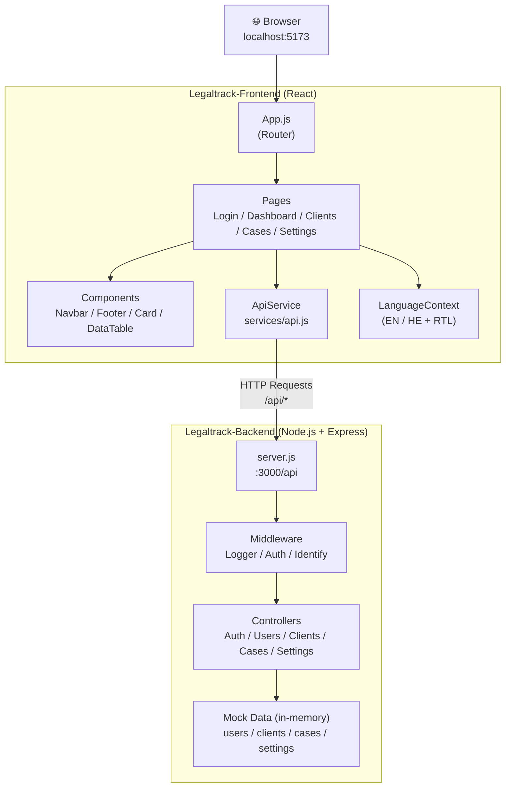

# LegalTrack — Full Stack Project

A web application for lawyers and law firms to manage cases, clients, and deadlines.

---

## Project Structure

```
├── Legaltrack-Backend/    # Node.js + Express REST API
├── Legaltrack-Frontend/   # React.js frontend application

```

## System Architecture



---

## Quick Start

### 1. Start the Backend

```bash
cd Legaltrack-Backend
npm install
node server.js
```

- Runs on: `http://localhost:3000`
- API base path: `/api`

### 2. Start the Frontend

```bash
cd Legaltrack-Frontend
npm install
npm start
```

- Runs on: `http://localhost:5173`
- Connects to backend at: `http://localhost:3000/api`

> Start the backend **before** the frontend.

---

## Demo Credentials

```
Email:    david@legaltrack.com
Password: 123456
```

---

## Tech Stack

| Layer    | Technology              |
|----------|-------------------------|
| Backend  | Node.js, Express        |
| Frontend | React.js, React Router  |
| Data     | In-memory mock data     |
| Auth     | Role-based (x-user-role header) |

---

## API Overview

Base URL: `http://localhost:3000/api`

| Resource  | Endpoints                          |
|-----------|------------------------------------|
| Auth      | POST /api/auth/login, POST /api/auth/logout, GET /api/auth/me |
| Users     | GET/POST /api/users, GET/PUT/DELETE /api/users/:id |
| Clients   | GET/POST /api/clients, GET/PUT/DELETE /api/clients/:id |
| Cases     | GET/POST /api/cases, GET/PUT/DELETE /api/cases/:id |
| Settings  | GET/PUT /api/settings              |

For full API documentation see `Legaltrack-Backend/README.md`.

---

## Frontend Pages

| Page      | Route        | Description                          |
|-----------|--------------|--------------------------------------|
| Login     | /            | Email + password login               |
| Dashboard | /dashboard   | Stats, recent cases, cases table     |
| Clients   | /clients     | Client list, cards, add new client   |
| Cases     | /cases       | Case list, filter by status, add new |
| Settings  | /settings    | Edit username, email, theme, language|

For full frontend documentation see `Legaltrack-Frontend/README.md`.

---

