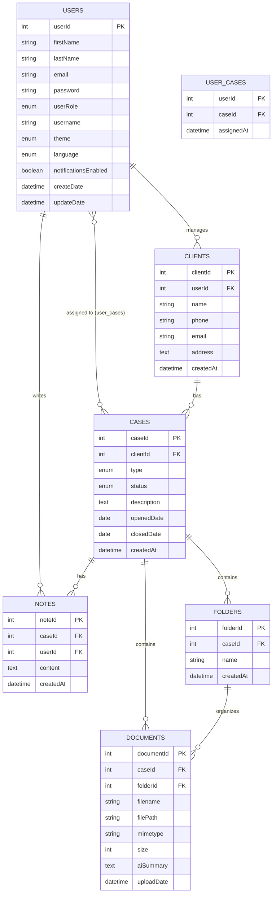

# ⚖️ LegalTrack — AI-Powered Case Management System

A full-stack web application for lawyers and law firms to manage cases, clients, documents, deadlines, and notes — powered by AI.

---

## 🚀 Tech Stack

| Layer | Technology |
|-------|-----------|
| Frontend | React.js, React Router, Recharts, Socket.IO Client |
| Backend | Node.js, Express |
| Database | MySQL + Sequelize ORM |
| Real-time | Socket.IO |
| AI | Groq API (LLaMA 3.3 70B) |

---

## 📁 Project Structure

```
LegalTrack/
├── Legaltrack-Backend/
│   ├── src/
│   │   ├── routes/
│   │   │   ├── auth.js
│   │   │   ├── users.js
│   │   │   ├── clients.js
│   │   │   ├── cases.js
│   │   │   ├── documents.js
│   │   │   ├── folders.js
│   │   │   ├── notes.js
│   │   │   ├── settings.js
│   │   │   └── ai.js
│   │   ├── controllers/
│   │   ├── middleware/
│   │   │   ├── auth.js        ← Role-based access control
│   │   │   ├── identify.js    ← User identification
│   │   │   ├── logger.js      ← Request logger
│   │   │   └── upload.js      ← File upload (multer)
│   │   └── server.js
│   ├── models/
│   │   ├── index.js           ← Sequelize setup + associations
│   │   ├── User.js
│   │   ├── Client.js
│   │   ├── Case.js
│   │   ├── Document.js
│   │   ├── Folder.js
│   │   ├── Note.js
│   │   └── UserCase.js        ← Junction table
│   ├── migrations/
│   │   └── seed.js
│   ├── uploads/               ← Uploaded files
│   ├── .env.example
│   └── package.json
└── Legaltrack-Frontend/
    └── src/
        ├── components/
        │   ├── Navbar/
        │   ├── Footer/
        │   ├── Card/
        │   ├── DataTable/
        │   ├── Notifications/  ← WebSocket notifications
        │   └── AiChat/         ← Floating AI assistant
        ├── pages/
        │   ├── LoginPage/
        │   ├── Dashboard/
        │   ├── CasesPage/
        │   ├── CaseDetailPage/
        │   ├── ClientsPage/
        │   └── SettingsPage/
        ├── services/
        │   ├── api.js
        │   └── socket.js
        ├── i18n/               ← English / Hebrew support
        └── App.js
```

---

## ⚙️ Installation & Setup

### Prerequisites
- Node.js v18+
- MySQL 8+
- Groq API Key (free at [console.groq.com](https://console.groq.com))

---

### 1. Clone the repository
```bash
git clone https://github.com/YehonatanArieh8/LegalTrack.git
cd LegalTrack
```

---

### 2. Database Setup
```bash
mysql -u root -p
```
```sql
CREATE DATABASE legaltrack;
exit
```

---

### 3. Backend Setup
```bash
cd Legaltrack-Backend
npm install
```

Create `.env` file (see `.env.example`):
```
PORT=3000
DB_HOST=localhost
DB_PORT=3306
DB_NAME=legaltrack
DB_USER=root
DB_PASSWORD=your_mysql_password
GROQ_API_KEY=your_groq_api_key
```

Seed the database with demo data:
```bash
node migrations/seed.js
```

Start the backend:
```bash
node src/server.js
```

> Server will run on **http://localhost:3000**
> Sequelize will automatically create all tables on first run.

---

### 4. Frontend Setup
```bash
cd Legaltrack-Frontend
npm install
npm start
```

> Frontend will run on **http://localhost:5173**

---

## 👤 Demo Credentials

| Email | Password | Role |
|-------|----------|------|
| david@legaltrack.com | 123456 | Admin |
| sarah@legaltrack.com | 123456 | Manager |

---

## 🌐 API Base URL

```
http://localhost:3000/api
```

All protected routes require headers:
```
x-user-id: <userId>
x-user-role: <userRole>
```

---

## 📡 API Endpoints

### Auth
| Method | Endpoint | Auth | Description |
|--------|----------|------|-------------|
| POST | /api/auth/register | No | Register new user |
| POST | /api/auth/login | No | Login |
| POST | /api/auth/logout | No | Logout |
| GET | /api/auth/me | Yes | Get current user |

### Users
| Method | Endpoint | Role | Description |
|--------|----------|------|-------------|
| GET | /api/users | Any | Get all users |
| GET | /api/users/:id | Any | Get user by ID |
| POST | /api/users | admin/manager | Create user |
| PUT | /api/users/:id | admin/manager | Update user |
| DELETE | /api/users/:id | admin | Delete user |

### Clients
| Method | Endpoint | Role | Description |
|--------|----------|------|-------------|
| GET | /api/clients | Any | Get my clients |
| GET | /api/clients/:id | Any | Get client by ID |
| POST | /api/clients | admin/manager | Create client |
| PUT | /api/clients/:id | admin/manager | Update client |
| DELETE | /api/clients/:id | admin | Delete client |

### Cases
| Method | Endpoint | Role | Description |
|--------|----------|------|-------------|
| GET | /api/cases | Any | Get my cases |
| GET | /api/cases/:id | Any | Get case by ID |
| POST | /api/cases | admin/manager | Create case |
| PUT | /api/cases/:id | admin/manager | Update case |
| DELETE | /api/cases/:id | admin | Delete case |

### Documents
| Method | Endpoint | Description |
|--------|----------|-------------|
| POST | /api/documents/upload | Upload file (PDF, Word, Excel, Image) |
| GET | /api/documents/:id | Get document metadata |
| GET | /api/documents/:id/download | Download file |
| PUT | /api/documents/:id | Replace file |
| DELETE | /api/documents/:id | Delete document |

### Folders
| Method | Endpoint | Description |
|--------|----------|-------------|
| GET | /api/folders/:caseId | Get folders for case |
| POST | /api/folders | Create folder |
| DELETE | /api/folders/:id | Delete folder |
| PATCH | /api/folders/move/:docId | Move document to folder |

### Notes
| Method | Endpoint | Description |
|--------|----------|-------------|
| GET | /api/notes/:caseId | Get notes for case |
| POST | /api/notes | Create note |
| DELETE | /api/notes/:id | Delete note |

### Settings
| Method | Endpoint | Description |
|--------|----------|-------------|
| GET | /api/settings | Get user settings |
| PUT | /api/settings | Update settings |

### AI
| Method | Endpoint | Description |
|--------|----------|-------------|
| POST | /api/ai/summarize/:docId | AI summarize document |
| POST | /api/ai/chat | AI chat assistant |

---

## 🔌 WebSocket Events

| Event | Direction | Trigger |
|-------|-----------|---------|
| `case:created` | Server → All Clients | New case created |
| `case:updated` | Server → All Clients | Case status changed |
| `document:uploaded` | Server → All Clients | File uploaded |
| `folder:created` | Server → All Clients | Folder created |
| `note:created` | Server → All Clients | Note added |

---

## 🤖 AI Features

### 1. Document Summarization
- Upload any PDF to a case
- Click **🤖 AI Summary**
- AI reads the document and returns a structured summary with key points, dates, and clauses
- Summary is saved to the database

### 2. AI Chat Assistant
- Floating chat widget available on all pages
- Supports natural language queries
- Can navigate the app automatically ("Take me to cases")
- Answers legal questions and provides guidance

**AI Provider:** [Groq](https://console.groq.com) — Free tier, no credit card required
**Model:** `llama-3.3-70b-versatile`

---

## 🗄️ Database ERD



### Relationships Summary

| Relationship | Type | Description |
|-------------|------|-------------|
| User → Clients | One-to-Many | A lawyer manages multiple clients |
| Client → Cases | One-to-Many | A client has multiple cases |
| User ↔ Cases | Many-to-Many | Multiple lawyers can work on a case (via user_cases) |
| Case → Documents | One-to-Many | A case has multiple documents |
| Case → Folders | One-to-Many | A case has multiple folders |
| Folder → Documents | One-to-Many | A folder contains multiple documents |
| Case → Notes | One-to-Many | A case has multiple notes |
| User → Notes | One-to-Many | A user writes multiple notes |

---

## 🔒 Security

- Role-based access control: `admin` / `manager` / `user`
- User data isolation — each lawyer sees only their own clients and cases
- API keys stored in `.env` only — never exposed to frontend
- File type validation on upload
- SQL injection prevention via Sequelize parameterized queries

---

## ⚠️ Known Limitations

- Authentication uses mock token (no JWT signature verification)
- Local file storage only (no cloud storage)
- Single-firm deployment
- Desktop browsers only
- AI summarization supports text-based PDFs only (not scanned images)

---
