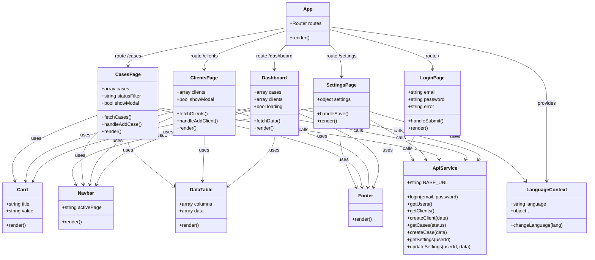

# LegalTrack Frontend

A React.js frontend application for the LegalTrack case management system, connected to the LegalTrack backend API.

## Installation

```bash
npm install
```

## Running the App

```bash
npm start
```

- Port: `5173`
- Base URL: `http://localhost:5173`
- Backend API URL: `http://localhost:3000`

> Make sure the backend server is running on port 3000 before starting the frontend.

## Configuration

The backend URL is configured in `.env`:

```
REACT_APP_API_URL=http://localhost:3000
PORT=5173
```

Change these values if your backend or frontend run on different ports.

## Project Structure

```
src/
├── components/
│   ├── Navbar/
│   │   ├── Navbar.js
│   │   └── Navbar.css
│   ├── Footer/
│   │   ├── Footer.js
│   │   └── Footer.css
│   ├── Card/
│   │   ├── Card.js
│   │   └── Card.css
│   └── DataTable/
│       ├── DataTable.js
│       └── DataTable.css
├── pages/
│   ├── LoginPage/
│   │   ├── LoginPage.js
│   │   └── LoginPage.css
│   ├── Dashboard/
│   │   ├── Dashboard.js
│   │   └── Dashboard.css
│   ├── ClientsPage/
│   │   ├── ClientsPage.js
│   │   └── ClientsPage.css
│   ├── CasesPage/
│   │   ├── CasesPage.js
│   │   └── CasesPage.css
│   └── SettingsPage/
│       ├── SettingsPage.js
│       └── SettingsPage.css
├── services/
│   └── api.js
├── i18n/
│   ├── translations.js
│   └── LanguageContext.js
└── App.js
```

## Class Diagram



## Demo Credentials

```
Email:    david@legaltrack.com
Password: 123456
```

## Pages

### Login
- Email and password validation
- Redirects to dashboard on success
- Shows error message on failure

### Dashboard
- Overview stats: total cases, open cases, pending cases, total clients
- Recent cases cards
- Full cases table with status badges and formatted dates

### Clients
- All clients displayed as cards and in a table
- Add new client via modal form with validation

### Cases
- Filter cases by status (All / Open / Pending / Closed)
- Cases displayed as cards and in a table
- Add new case via modal form with client dropdown

### Settings
- Edit username, email, theme, language, notifications
- Changes apply immediately (theme + language)
- Saves to backend

## Features

- **Dark / Light mode** — toggle in Settings, persists across sessions
- **Hebrew / English** — full UI translation + RTL/LTR layout, toggle in Settings
- **Protected routes** — redirects to login if not authenticated
- **Reusable components** — Card, DataTable used across all pages
- **Loading and error states** on all data-fetching pages
- **Formatted dates** — displayed as date - time (no seconds)

---

